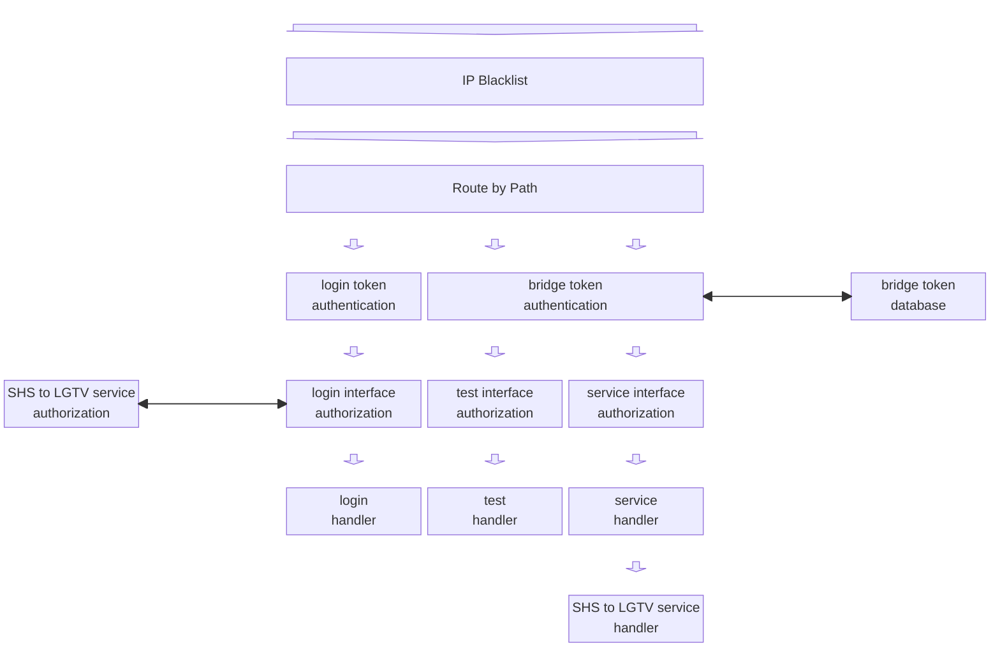

# The Bridge

The bridge works in conjunction with the [skill](./skill.md#the-skill) to enable Alexa support on LG webOS TVs that lack built-in Alexa support. The bridge communicates with the skill using [the Skill to Bridge Interface](./skill-to-bridge-interface.md#the-skill-to-bridge-interface).

The bridge expects to be running as a service on the same network as the LG webOS TVs to be controlled by Alexa. The bridge expects to be accessible from the internet through a reverse proxy.

The bridge is divided into a frontend, a middle and a backend.

## The Frontend

The frontend manages the communication link between the skill and the bridge. It

- implements an HTTP server,
- routes the interfaces based on HTTP request method and path,
- controls access to the interfaces based on the HTTP Authorization request header,
- handles login interface requests,
- handles test interface requests, and
- forwards service interface requests (which are Smart Home Skill Directives) to the middle for handling.

### Skill to Bridge Interface Authorization

#### Login Token Authorization

It is important to note that the authorization to use the service is the result of the user using the skill to configure the bridge's hostname. Therefore, the bridge can only trust that the JWT came from the skill and that the skill believes the authorization is genuine. So, as part of the JWT validation, the bridge compares the email address against its list of authorized emails and the service against its URL before accepting the JWT.

#### Bridge Token Authorization

## The Middle

The middle translates between the Smart Home Skill signaling and the LG webOS TV signaling. It

- translates between the Smart Home Skill signaling and the LG webOS TV signaling, and
- controls access based on the bearer tokens in the Smart Home Skill Directives.

### Smart Home Skill Service Authorization

Each Smart Home Skill Directive contains a bearer token (SKILL_TOKEN or skillToken).

The middle maintains a database (~/.ForLGwebOSTV/middle.nedb) mapping Directive's bearer tokens (skillToken) to user's email addresses (email).

If a Directive's bearer token is not found in the database, then the middle attempts to map the Directive's bearer token to the user's email address using the procedure outlined in ["Retrieving the email Address using the Smart Home Skill"](./skill.md#retrieving-the-email-address-using-the-smart-home-skill). If the attempt is successful, then the email address is compared with the email address associated with the bridge token used to authorize the Service Request message containing the Directive. If they match, then the bearer token to email address mapping is added to the database.

If the Directive's bearer token does not map to an email address then authorization fails. If email address associated with the Directive's bearer token does not match the email address associated with the bridge token used to authorize the Service Request message containing the Directive, then authorization fails. If authorization fails, then the middle responds with an `Alexa ErrorResponse` specifying `INVALID_AUTHORIZATION_CREDENTIAL`.

## The Backend

The backend is implemented by the [Backend](../../../docs/classes/src/bridge/lib/backend/index.ts) class in [src/bridge/lib/backend/index.ts](../../../src/bridge/lib/backend/index.ts).

The backend manages the communication links between the backend and the LG webOS TVs being controlled. It

- searches for LG webOS TVs on the network,
- maintains connections with the LG webOS TVs it finds and
- routes messages between the middle and the the LG webOS TVs being controlled.

The backend contains a searcher and a controller. The controller contains a control for each LG webOS TV the backend is controlling. The searcher searches for LG webOS TVs on the local network. When it finds one, it alerts the controller. The controller allocates a control. The control connects to the TV, making it possible for the middle to send requests to and receive responses from the TV.

### The Searcher

The searcher is implemented by the [BackendSearcher](../../../docs/classes/bridge_lib_backend_backend_searcher.BackendSearcher.md) class in [src/bridge/lib/backend/backend-searcher.ts](../../../src/bridge/lib/backend/backend-searcher.ts).

The searcher uses UPnP discovery ([UPnP Device Architecture 1.1](https://upnp.org/specs/arch/UPnP-arch-DeviceArchitecture-v1.1.pdf)) along with LG Electronics custom service type `urn:lge-com:service:webos-second-screen:` to detect the LG webOS TVs on the local network. This appears to be the most reliable way to find LG webOS TVs because of the more targeted service type, the cleaner response headers and cleaner device description fields. Other UPnP service types advertised by LG webOS TVs appear to have either less consistent response headers or device description fields making it more difficult to identify them. My LG webOS TV advertises as [UPnP 1.0](https://upnp.org/specs/arch/UPnP-arch-DeviceArchitecture-v1.0.pdf). However, the discovery implemented by my TV complies with [UPnP 1.1](https://upnp.org/specs/arch/UPnP-arch-DeviceArchitecture-v1.1.pdf) and my TV accepts UPnP 1.1 as well.

When the searcher detects a LG webOS TV, it alerts the controller.

### The Controller

The controller is implemented by the [BackendController](../../../docs/classes/bridge_lib_backend_backend_controller.BackendController.md) class in [src/bridge/lib/backend/backend-controller.ts](../../../src/bridge/lib/backend/backend-controller.ts).
