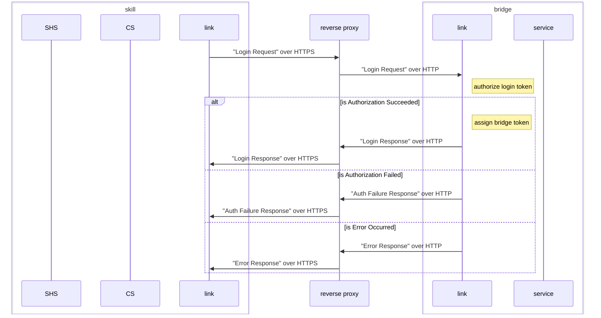
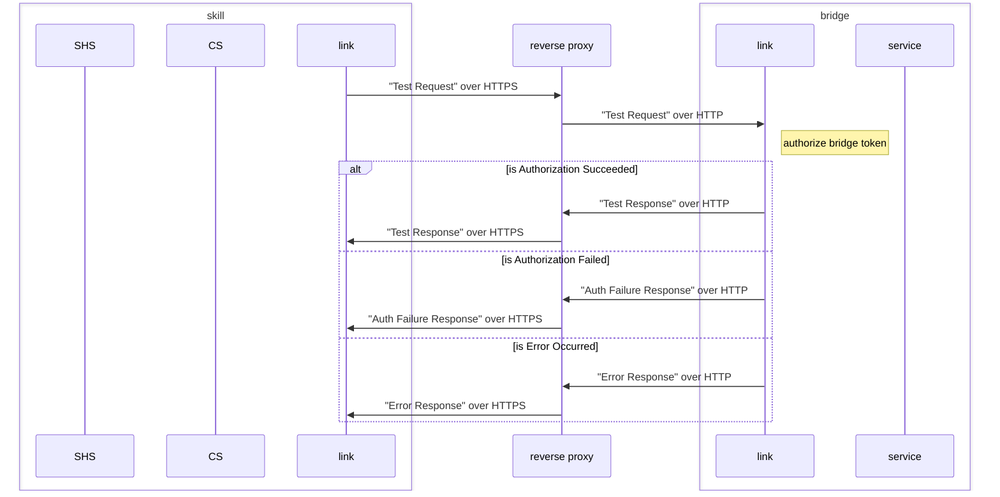
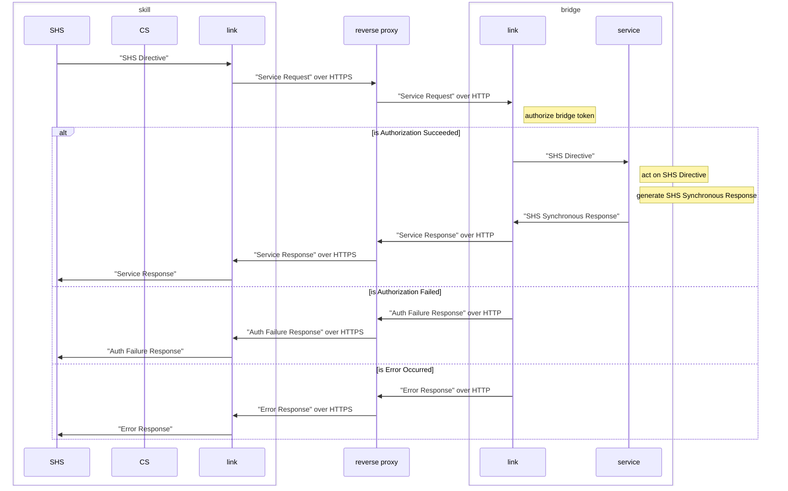

# The Skill to Bridge Interface

The skill and the bridge communicate over HTTP with the skill in the role of HTTP client and the bridge in the role of HTTP server. Access is controlled using tokens carried in the HTTP request Authorization header.

The bridge presents the skill with three interfaces: the login interface, the test interface and the service interface(s). The login interface allows the skill to request and be granted access to a service provided by the bridge. The test interface allows a skill to test whether or not it has access to the bridge. The service interface performs services on behalf of a skill. For example, the current implementation has a service interface that allows the skill to forward Smart Home Skill Directives to the bridge for handling.

While alexa-for-lg-webos-tv has a specific function, the skill to bridge interface is designed to be generic.

- [The Reverse Proxy](#the-reverse-proxy)
- [Interface Authorization](#interface-authorization)
  - [The Login Token](#the-login-token)
  - [The Bridge Token](#the-bridge-token)
- [The Login Interface](#the-login-interface)
  - [The Login Interface Message Flow](#the-login-interface-message-flow)
  - [The Login Interface Message Formats](#the-login-interface-message-formats)
- [The Test Interface](#the-test-interface)
  - [The Test Interface Message Flow](#the-test-interface-message-flow)
  - [The Test Interface Message Formats](#the-test-interface-message-formats)
- [The Service Interface](#the-service-interface)
  - [The Service Interface Message Flow](#the-service-interface-message-flow)
  - [The Service Interface Message Formats](#the-service-interface-message-formats)

## The Reverse Proxy

[As mentioned above](#the-skill-to-bridge-interface), the interfaces run over HTTP and interface access is controlled using tokens carried in the HTTP request Authorization header. For the tokens to be effective at controlling access to the APIs, the transport carrying HTTP must be protected against eavesdropping and tampering. Therefore, the skill implementation requires the transport be HTTPS using a certificate issued by a certificate authority trusted by the Amazon cloud.

However, the bridge only supports HTTP. It doesn't support HTTPS. If your home network is like mine, then you have a server that's responsible for renewing [Let's Encrypt](https://letsencrypt.org) issued SSL/TLS certificates as well as acting as a reverse proxy for internal web pages/services that must be accessed from the internet. Doing this has many advantages, including simplifying SSL/TLS certificate management and simplifying web service implementations. The bridge implementation assumes it will be deployed on such a network behind a reverse proxy.

## Interface Authorization

The bridge consumes resources. Therefore, even though the services supported by the bridge may have protections against misuse, the bridge needs its own protections against misuse.

[As mentioned above](#the-skill-to-bridge-interface), interface access is controlled using tokens carried in the HTTP request Authorization header. The token is bound to a user and a bridge. The token enables the bridge to verify that the message is from a trusted skill and that the message is being sent on behalf of a user who has been authorized to use the bridge.

When the bridge receives a message on any skill to bridge interface, it verifies the token. If token verification fails, then the bridge rejects the message. After some number of repeated token verification failures originating from the same IP address, the bridge may (temporarily) block the IP address.

There are two types of tokens: the login token and the bridge token. The skill uses a login token when accessing the login interface. The skill uses a bridge token when accessing the test interface or any service interface. The skill uses the login interface to "exchange" a login token for a bridge token. Login tokens are exchanged for bridge tokens because bridge tokens are less expensive to transmit, less expensive to verify and easier to revoke.

### The Login Token

The skill uses a login token (LOGIN_TOKEN) to request access on behalf of a user to the bridge. It generates the login token. It uses the login token when accessing the login interface to request access to the test and service interfaces on behalf of a user.

#### The Login Token Format

The login token is a JSON Web Token (JWT) with the form

```json
{
    "iss": "For LG webOS TV",
    "sub": "SKILL_TOKEN",
    "aud": "https://BRIDGE_HOSTNAME",
    "exp": "NOW + 1m"
}
```

The login token's `"iss"` field identifies the skill. In the skill implementation and the bridge implementation, it is set by `constants.jwt.iss` in [src/common/constants.ts](../../src/common/constants.ts) and is currently set to

```text
"For LG webOS TV"
```

The login token's `"sub"` field identifies the user. SKILL_TOKEN is the access token found in the messages of account-linked skills.

The login token's `"aud"` field identifies the service. It's a URL that identifies the bridge. BRIDGE_HOSTNAME is the bridge's DNS name. In the skill implementation, BRIDGE_HOSTNAME is set using the Custom Skill.

The login token's `"exp"` field specifies when the login token will expire. It's recommended that the login token have a short lifetime in order to reduce the chance of replay. In the skill implementation, the login token is set to expire one minute after it was generated.

#### The Login Token Authorization

The bridge verifies that the login came from a trusted skill. It does this by verifying that the login token was signed using a private key belonging to the skill.

The bridge verifies that the login token has not expired. If verification fails, then the login token authorization fails.

The bridge verifies that the user is a valid Login with Amazon user.

The bridge verifies that the skill identified by the login token is allowed to access the bridge identified in the login token on behalf of the user identified in the login token. If verification fails, then the login token authorization fails.

In the implementation, the skill requires the user to share their email with skill when Account Linking because the bridge uses the user's email address to identify allowed users of the bridge.

### The Bridge Token

The bridge uses the bridge token to grant access to a service interface. The skill can request a bridge token using the login interface. The returned bridge token is bound to the user and bridge from the login token.

The indirect bridge token rather than the direct login token is used to access the test and service interfaces because bridge tokens are less expensive to transmit, less expensive to verify and easier to revoke.

#### The Bridge Token Format

The bridge token can be any base64 string. As it is assigned by the bridge and simply reflected by the skill, it's up to the bridge to ensure that it assigns the skill a bridge token that it can later validate.

#### The Bridge Token Authorization

On the link's test interface, the bridge verifies that the bridge token belongs to an authorized user of the bridge.

On the link's service interface, the bridge verifies that the bridge token belongs to an authorized user of the bridge. In addition, it verifies that the bridgeToken is not stale. It does this by making sure that the bridge token is for a linked Amazon Account and that the bridge token was requested using the same skill access token as the access token found in the CS/SHS request message being transported by the link's service interface. Therefore, the skill should ensure that a user's bridge token does not fail authorization for this reason by requesting a new bridge token for the user when it receives a CS/SHS request message for the user with a new access token.

## The Login Interface

The skill uses the login interface to request a bridge token that the skill can use to access the bridge on behalf of a user. The skill requests access by sending a `Login Request` authorized by a login token.

Assuming the login token authorizes, the bridge assigns a bridge token granting the user from the login token access to the bridge requested in the login token, and sends a `Login  Response` message containing the assigned bridge token. Otherwise, it sends an `Auth Failure Response` message. If there is an error, then it sends an `Error Response` message.

Only the most recent bridge token issued for granting a specific user access to the bridge is valid.

### The Login Interface Message Flow



### The Login Interface Message Formats

The `Login Request` message is the HTTP request header:

```http
GET /login
Host: BRIDGE_HOSTNAME
Authentication: Bearer LOGIN_TOKEN
```

The `Login Response` message is the HTTP response header and body

```http
HTTP/1.1 200 OK
Content-Type: application/json
```

```json
{
    token: BRIDGE_TOKEN
}
```

The `Auth Failure Response` message is the HTTP response header and body

```http
HTTP/1.1 401 Unauthorized
Content-Type: application/json
```

```json
{}
```

The `Error Response` message is the HTTP response header and body

```http
HTTP/1.1 500 Internal Server Error
Content-Type: application/json
```

```json
{}
```

## The Test interface

The skill uses the test interface to test that a bridge token is valid. The skill sends a `Test Request` message authorized by a bridge token.

Assuming the bridge token is valid, the bridge sends a `Test Response` message. Otherwise, it sends an `Auth Failure Response` message. If there is an error, then it sends an `Error Response` message.

This interface allows a skill to discover that a bridge token is valid on the bridge. It does not allow the skill to discover the user or the service for which the bridge token is valid.

### The Test Interface Message Flow



### The Test Interface Message Formats

The `Test Request` message is the HTTP request header

```http
GET /test
Host: BRIDGE_HOSTNAME
Authentication: Bearer BRIDGE_TOKEN
```

The `Test Response` message is the HTTP response header and body

```http
HTTP/1.1 200 OK
Content-Type: application/json
```

```json
{}
```

For the `Auth Failure Response` message is the HTTP response header and body

```http
HTTP/1.1 401 Unauthorized
Content-Type: application/json
```

```json
{}
```

The `Error Response` message is the HTTP response header and body

```http
HTTP/1.1 500 Internal Server Error
Content-Type: application/json
```

```json
{}
```

## The Service Interface

The skill uses the service interface to interact with the LG webOS TVs. The skill sends a `Service Request` message authorized by a bridge token and containing a Smart Home Skill Directive (SMART_HOME_SKILL_DIRECTIVE).

Assuming the bridge token is valid, the bridge fulfills the Directive and sends a `Service Response` message containing the resulting Smart Home Skill Synchronous Response (SMART_HOME_SKILL_SYNCHRONOUS_RESPONSE). Otherwise, it sends an `Auth Failure Response` message. If there is an error, then it sends an `Error Response` message.

The service interface only accepts Directives for the user authorized to use the service interface. The bridge checks whether or not the user associated with the bearer token in the Directive is the same as the user associated with the bridge token used to access the service interface. If they are not the same, then the Directive is responded to with an `Alexa ErrorResponse` specifying `INVALID_AUTHORIZATION_CREDENTIAL`.

### The Service Interface Message Flow



### The Service Interface Message Formats

The `Service Request` message is the HTTP request header and body

```http
POST /service/ForLGwebOSTV/v1
Host: BRIDGE_HOSTNAME
Authentication: Bearer BRIDGE_TOKEN
Content-Type: application/json
```

```text
SMART_HOME_SKILL_DIRECTIVE
```

The `Service Response` message is the HTTP response header and body

```http
HTTP/1.1 200 OK
Content-Type: application/json
```

```text
SMART_HOME_SKILL_SYNCHRONOUS_RESPONSE
```

The `Auth Failure Response` message is the HTTP response header and body

```http
HTTP/1.1 401 Unauthorized
Content-Type: application/json
```

```json
{}
```

The `Error Response` message is the HTTP response header and body

```http
HTTP/1.1 500 Internal Server Error
Content-Type: application/json
```

```json
{}
```
