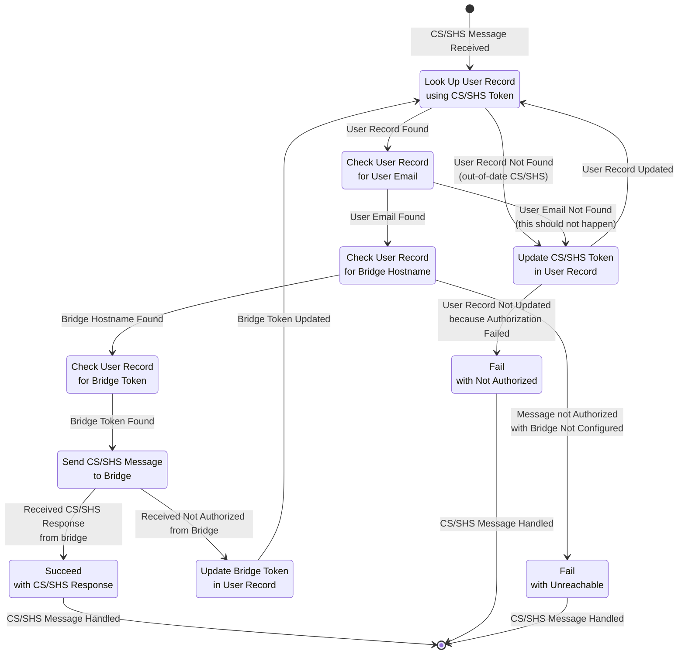
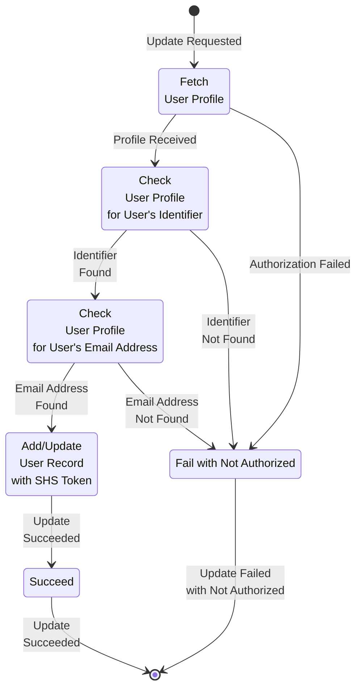

# The Skill

The skill works in conjunction with the [bridge](bridge.md#the-bridge) to enable Alexa support on LG webOS TVs that lack built-in Alexa support. The skill communicates with the bridge using [the Skill to Bridge Interface](./skill-to-bridge-interface.md#the-skill-to-bridge-interface).

The skill expects to be running as a lambda function on the Amazon cloud.

The skill is a [Multi-Capability Skill](https://developer.amazon.com/en-US/docs/alexa/smarthome/about-mcs.html) (MCS) that combines a [Custom Skill](https://developer.amazon.com/en-US/docs/alexa/custom-skills/understanding-custom-skills.html) (CS) and a [Smart Home Skill](https://developer.amazon.com/en-US/docs/alexa/smarthome/understand-the-smart-home-skill-api.html) (SHS). It uses the CS to establish a secure connection to the correct bridge, and it uses the SHS to control the televisions through the securely connected bridge.

## Account Linking

For the skill to work correctly, the CS and SHS must be able to share the user's bridge hostname. To do this, the skill relies on [Account Linking](https://developer.amazon.com/en-US/docs/alexa/account-linking/add-account-linking.html) using [Login With Amazon (LWA)](https://developer.amazon.com/apps-and-games/login-with-amazon). Once account linking is complete, CS request events and SHS request directives contain an access token that depends on the user but not the message. So, the skill can use the access token to link the user's CS and SHS enabling it to share the user's bridge hostname between the user's CS and SHS.

## Retrieving the User's Access Token

### Retrieving the User's Access Token from a Custom Skill Request Event

When a CS in linked to the user's Amazon account, CS request events contain an access token. The location of the access token in the CS request event is `handlerInput.requestEnvelope.context.System.user.accessToken`

### Retrieving the User's Access Token from a Smart Home Skill Request Directive

When an SHS in linked to the user's Amazon account, SHS request directives contain an access token. The location of the access token in the directive depends the type of directive. For the ["Alexa.Authorization" "AcceptGrant" directive](https://developer.amazon.com/en-US/docs/alexa/device-apis/alexa-authorization.html#acceptgrant-directive-example), the location is `directive.payload.grantee.token`. For the ["Alexa.Discovery" "Discover" directive](https://developer.amazon.com/en-US/docs/alexa/device-apis/alexa-discovery.html#discover-directive-example) the location is `directive.payload.scope.token`. For directives sent to a specific endpoint such as the ["Alexa.PowerController" "TurnOn" directive](https://developer.amazon.com/en-US/docs/alexa/device-apis/alexa-powercontroller.html#directives), the location is `directive.endpoint.scope.token`.

The alexa-for-lg-webos-tv's SHS implements the retrieval of the access token in the [getAccessToken](../../src/common/smart-home-skill/request.ts) function.

## Retrieving the User's Identifier

While the access token links a user's CS and SHS at a given time, the access token can change with time. To track a user's CS or SHS across time, the skill uses the User's Identifier (user_id).

Retrieving user_id is a two step process. First the skill retrieves the user's access token. Next the skill uses the access token to retrieve the user's profile using the Amazon User Profile API. Contained in the profile is user_id.

After the skill [retrieves the user's access token](#retrieving-the-users-access-token), it can request the user's profile from

```text
<https://api.amazon.com/user/profile>
```

by sending a GET request to the URL with the HTTP authorization header

```http
Authorization: Bearer ACCESS_TOKEN
```

where ACCESS_TOKEN is the value of the access token. The full request would look like

```http
Host: api.amazon.com
Accept: application/json
Authorization: Bearer _apiAccessToken_
GET <https://api.amazon.com/user/profile>
```

The response contains user_id as well as any other information the user agreed to share during account linking.

## The Database

The skill uses DynamoDB as its database.

The database has a table named ForLGwebOSTV. This table uses the user's email address as its key. And it contains the user's email address (email), bridge hostname (hostname), the bridge bearer token (bridgeToken) and SHS bearer token (skillToken) for each user. In addition, the database table has an associated Global Secondary Index (GSI) named skillToken_index. This GSI uses skillToken as its index. And it contains skillToken, email, hostname and bridgeToken for each user.

Using email as the table's key makes it easy for both the CS and the SHS to look up hostname and bridgeToken after they have used their respective tokens to retrieve the user's email address. When the user configures their bridge through interaction with the skill, the CS stores the bridge hostname (hostname) and bridge bearer token (bridgeToken) in the table keyed to user's email address (email). When the SHS needs to send a message to the bridge, it can look up hostname and bridgeToken in the table using email.

However, the SHS looking up hostname and bridgeToken using email is inefficient. If it used the email to look up hostname and bridgeToken, it would first need to use its bearer token to retrieve the user's profile from LWA profile server. Retrieving the profile every time it had a message to send would add needless delay in sending the message as well as add needless load on the LWA profile server. Instead, the SHS looks up hostname and bridgeToken in the GSI using the skillToken. If it does not find skillToken in the GSI, it uses the skillToken to retrieve the user's profile and uses the uses the user's email address to add skillToken to the table. After adding skillToken to the table, the SHS as able to look up hostname and bridgeToken in the GSI using the skillToken.

The alexa-for-lg-webos-tv skill's database functions are found [here](../../src/skill/lib/database.ts).

### Database Performance

There are a three things to notice besides the functions for setting the bridge hostname (setHostname), getting the bridge hostname (getHostname), setting the bridge's bearer token (setBridgeToken), getting the bridge's bearer token (getBridgeToken) and setting the SHS's bearer token (setSkillToken).

[Amazon provides recommendations on how to improve the performance of lambda functions by Amazon](https://aws.amazon.com/blogs/compute/operating-lambda-performance-optimization-part-2/). First, Amazon suggests maintaining the connection to databases outside of the handler. This ensures the lambda function establishes its connection to the database outside of the handler function. Doing this causes the lambda function to connect to the database once when it is loaded rather than every time the handler function is called. Second, Amazon suggests loading needed parts of the modules. Doing this reduces the lambda function load time. Third, Amazon recommends that the [DynamoDB connection enable HTTP keep-alive](https://docs.aws.amazon.com/sdk-for-javascript/v3/developer-guide/node-reusing-connections.html) to improve connections. The alexa-for-lg-webos-tv's skill implements all of these suggestions.

## Tracking Skill Tokens

The skill's design depends on the skill being linked to the user's Amazon account and that the user agreed to share their email address with the skill during linking. The CS and SHS parts of the MCS need to communicate user information (e.g. the user's bridge hostname). Unfortunately, only the user's email address appears to be the only globally unique information that the CS and SHS have in common.

When a Multi-Capability Skill is linked, Custom Skill Requests and Smart Home Skill Directives contain access tokens. Therefore, the skill rejects Custom Skill Requests and Smart Home Skill Directives that do not contain access tokens.

The skill tracks the access tokens. Because the access tokens for the Custom Skill and Smart Home Skill are different, the skill tracks the most recent Custom Skill access token and the most recent Smart Home SKill access token for each user. The user is identified by the email address they shared during account linking.

The skill stores this information in a database. When an access token is not found in the database, the skill queries the appropriate Amazon profile server for the email address associated with access token. If the query returns an email address, then the skill updates the database to reflect that this access token is the latest access token of this type for this email address. Otherwise, it rejects the message associated with the failed

The skill uses the access token to retrieve the user's email from their

The skill discards Custom Skill requests that don't contain an accessToken

## Sending on the Test and Service Interfaces

Sending a request on the test or service interfaces requires a bridge token from the bridge for authorization

The skill assumes that any request it's being asked to send on either the test or the service interface on behalf of a user would be authorized by the bridge. Therefore, if the skill has no bridge token for the user or has an invalid bridge token for the user, then the skill will attempt to get a valid bridge token from the bridge before giving up.



### Update Skill Token in the User Record

The skill token is used as authorization to fetch the user's identifier and email address from the profile server. Assuming the fetch is successful, the skill token for the User Record associated with the user's email address is updated/created with the value of the CS token. If the CS token fails authorization or no email address is returned, then update fails with the reason "not authorized".



### Update Bridge Token in User Record
